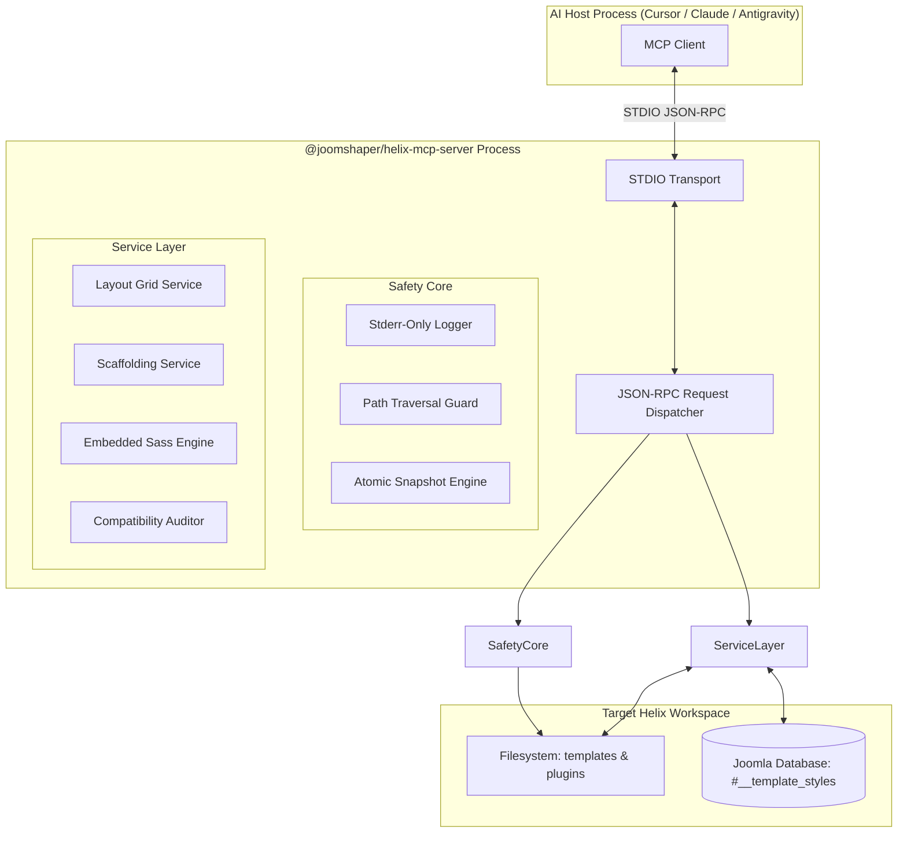

# Architecture Specification: `@joomshaper/helix-mcp-server`

## 1. Process & Runtime Model

`@joomshaper/helix-mcp-server` runs as a standalone Node.js process invoked by an AI client (such as Claude Desktop or Cursor) communicating via standard input/output (STDIO) using JSON-RPC 2.0.



---

## 2. Critical Production Guardrails

### A. Zero Standard Output (Stdout) Pollution
The STDIO transport relies entirely on `process.stdout` transmitting pure, uncorrupted JSON-RPC payloads. Any stray `console.log()` statement in the server or any dependent library will corrupt the frame stream and disconnect the client.
- **Enforcement**: All logging is routed through `Logger.ts` which outputs strictly to `process.stderr` or a localized log file (`.helix-mcp/server.log`).

### B. Path Traversal Protection
All file operations accept paths that are normalized and verified against the detected Joomla root:
```typescript
function assertWithinWorkspace(targetPath: string, rootDir: string): void {
  const resolved = path.resolve(rootDir, targetPath);
  if (!resolved.startsWith(path.resolve(rootDir))) {
    throw new Error(`Security Exception: Access denied outside workspace root: ${targetPath}`);
  }
}
```

### C. Atomic Backups & Snapshot Engine
Before mutating any database record or template layout file:
1. The current state is serialized into `.helix-mcp/snapshots/{timestamp}_{action}.json`.
2. The mutation is executed.
3. If the mutation fails or if the developer requests an undo, the `helix_rollback` tool restores the previous snapshot instantly.

---

## 3. Data Flow for Layout Grid Mutations

1. **Client Request**: AI calls `helix_update_row` with proposed row ID and column distribution.
2. **Schema & Grid Validation**:
   - Verify row exists.
   - Verify `sum(column.width) === 12`.
   - Verify module positions exist in `templateDetails.xml`.
3. **Snapshot**: Current `params` saved to snapshot directory.
4. **Persistence**:
   - Write updated params into Joomla database (`#__template_styles`) if DB credentials are present.
   - Synchronize with local template preset/backup JSON file.
5. **Response**: Return formatted diff and status to AI client.
